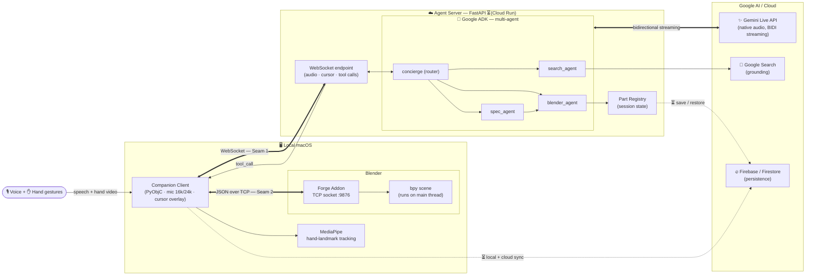
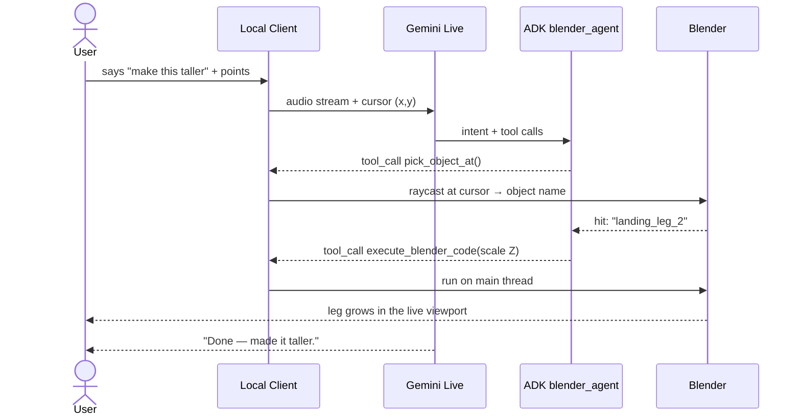

# Mark 58 — Architecture & Tooling

How Gemini, Google ADK, Blender, Firebase, and the supporting tools fit together.
Solid lines = built today · dashed lines / ⏳ = planned (see `plan.md` Steps 12–15).

## System diagram

## What each tool does

| Tool | Role in Mark 58 | Status |
|---|---|---|
| **Gemini Live API** (native audio) | The realtime brain: continuous listening, natural speech in/out, barge-in interruption. Streams bidirectionally with the agent server. | ✅ Built |
| **Google ADK** | Orchestrates the multi-agent system and tool calling — `concierge` routes to `blender_agent` (modeling), `spec_agent` (terse request → Build Spec), `search_agent` (facts). | ✅ Built |
| **Gemini function/tool calling** | Bridges language → action: the model calls `execute_blender_code`, `pick_object_at`, `get_object_info`, `frame_object`. | ✅ Built |
| **Google Search** | Grounding for factual questions and reference dimensions via `search_agent`. | ✅ Built |
| **FastAPI + WebSockets** | Streams audio, cursor, and tool calls between the cloud agent and the local client (Seam 1). | ✅ Built |
| **MediaPipe** | Webcam hand-landmark tracking → fingertip cursor for pointing/picking. | ✅ Built |
| **Blender + Forge addon** | The 3D workshop. Addon hosts a TCP socket (Seam 2) and runs each command on Blender's main thread via `bpy.app.timers`. | ✅ Built |
| **PyObjC / AppKit** | Native macOS client: mic I/O, audio playback, on-screen cursor overlay sidebar. | ✅ Built |
| **Part Registry** | Per-session record of every built object so it can be inspected and re-edited. | ✅ Built |
| **Firebase / Firestore** | Persist sessions, scenes, and the Part Registry locally then to the cloud. | ⏳ Planned (Steps 12, 14) |
| **Cloud Run** | Host the agent server remotely instead of local dev. | ⏳ Planned (Step 15) |

## Example: "make this taller" (request → action)

